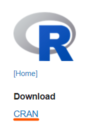
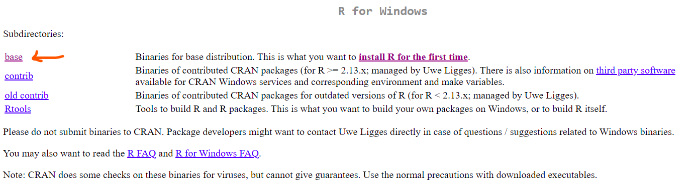
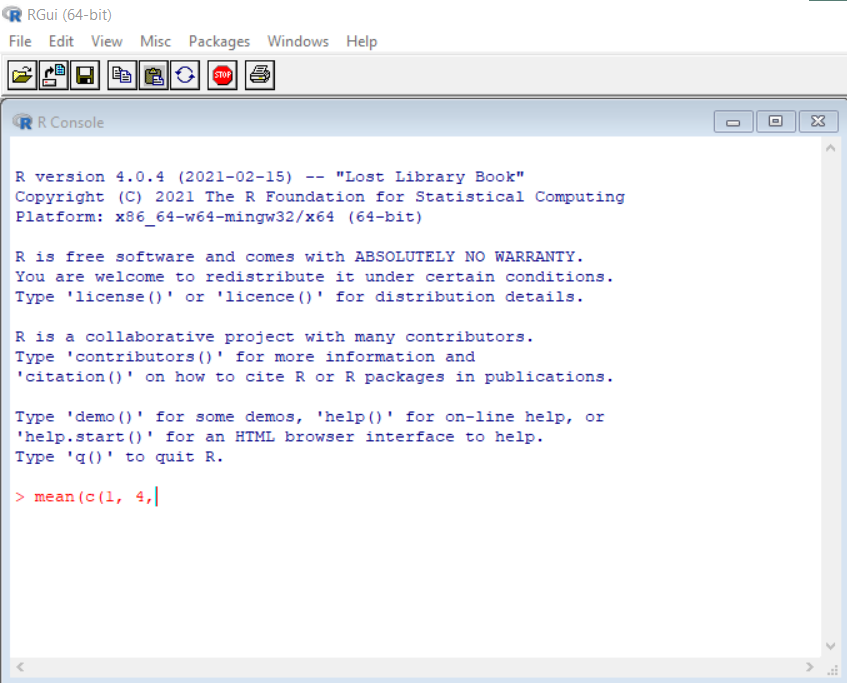
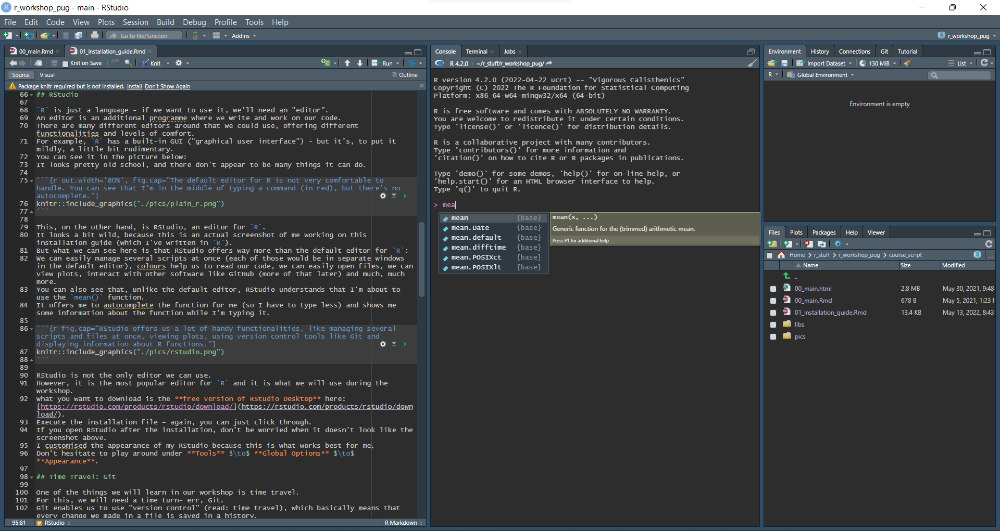
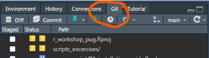
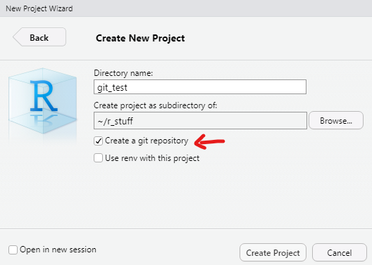
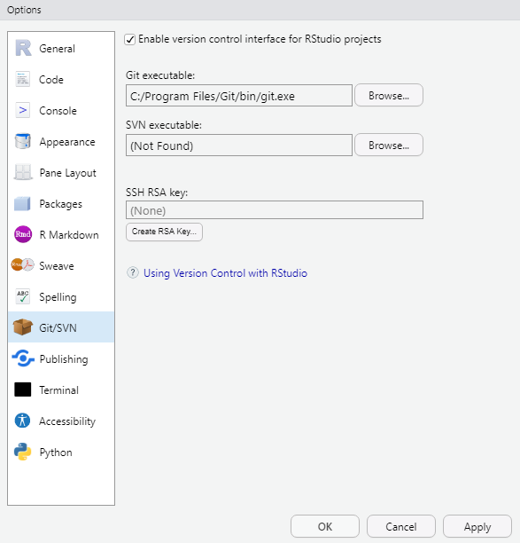
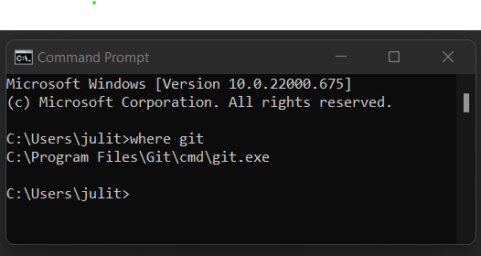
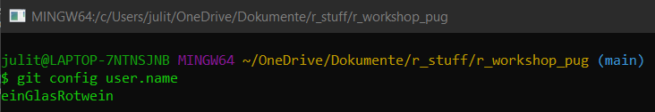
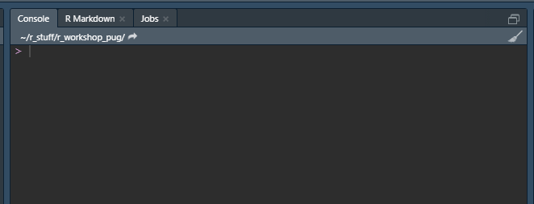

# Installation Guide

Hello and welcome to the introductory `R` course at the PuG 2021!
My name is [Juli Tkotz](https://juli-tkotz.de/) and I have the honour to be your guide through the `R` universe.
Before the actual workshops starts, I would like you to set up a few things on your computer.
I want to spend as much time as possible with actual coding during the workshop, and since installing things always takes up a bit of time, we'll frontload that bit.
Think of it as your personal Hogwarts shopping list - you have to get your robes and your books and your wand and stuff so you'll be all set to do the real magic once you arrive in Hogwarts.

## Every computer is different

That being said, you all have different setups.
You have different computers with different operating systems, and sometimes that means that some details work differently for you.
But no worries, if something goes wrong, whatever it is, we will be able to get `R` up and running on your computer.
Should you get stuck at some point, don't hesitate to shoot me an email at <juliane.tkotz@zi-mannheim.de>.
That being said, my installation guide is written from a Windows 10 perspective.

You will sometimes hear that people don't like installing `R` (or any other programming language, for that matter) and dread updating it even more.
I'm here to tell you that it's not that bad at all.
In fact, just stripped my computer of every single programme I normally use in my everyday `R`-related workflow so I can go through the setup with you.
That should show you that there is no need to worry too much about installing or un-installing your `R`-stuff on your computer.
You can't break anything (nothing that can't be fixed, at least).

## Your magic abilities - R

Within our Hogwarts metaphor, imagine `R` as your magic abilities.
Some people might be born with it, but we need to download it at  [https://www.r-project.org/](https://www.r-project.org/).
Right on the start page, you can find a download link via CRAN ("The Comprehensive R Archive Network").

```{r out.width='30%'}

```

When clicking it, you will be asked to choose a CRAN mirror.
That sounds a bit obscure.
Simply put, the those "mirrors" around the world are servers containing identical information, in this case, the source code, additional packages and all the documentation of `R`.
The advantage is that you can choose a server near your location for better bandwidth, and also, you will always be able to download `R`, even when one of the servers should be down.
Just think of it as an actual network of magical mirrors in a fantasy world that act as gateways which can transmit `R` packages between worlds.
Just pick one near you (anywhere in Germany is perfectly fine) and then download `R` for your operating system on the next page.
What you want is "base `R`".

```{r out.width='130%'}

```

Download `R` and execute the installation file.
Just click through the installation, the default settings are fine.

### OPTIONAL for Windows Users: Rtools

If you have windows, it is a good idea to install Rtools as well (mac OS users don’t need it, because your operating system should cover the functionalities Rtools adds on Windows).
It is not crucial, so feel free to skip this step.
Briefly, Rtools provides tools that are needed on Windows if you want to build `R` packages [^packages].

[^packages]: `R` packages are "add-ons" that provide additional functionalities for `R`. They are very important - you will most likely use several of them in your workflow.

Most of the time, you just download and install the package from CRAN, where you get the "binary version" of a package that is ready to be used on your operating system.
Sometimes, for some reason, the latest version of a package is not provided as a binary (yet); maybe because it’s just a few days old.
In this case, `R` will ask you whether it should "compile" the package from source, i.e. build it on your computer.
For this job, Rtools is needed on windows.
However, you also have the option not to compile the package and get a (slightly) older version of the package.
If you don't want to install Rtools yet, that is completely fine.
From time to time, `R` might throw a warning that Rtools is missing, but no worries - you can just ignore that.
If you want to have the option to compile packages and e.g. build packages on your own at some point, then install Rtools.
It can be found on the download page just where we found base `R`.
Only this time, we pick Rtools.
You will most likely want the 64 bit version.
Execute the installation file and just click through.

## The wand - RStudio

We can't use our magic abilities without a wand (an "editor" in our case).
Well, we can, but it is much much less comfortable and powerful.
I show you what I mean.
Look at this picture: You can see the default editor your get when installing `R`.
Functionalities are limited and it all looks pretty old school.

```{r out.width='80%', fig.cap="The default editor for R is not very comfortable to handle. You can see that I'm in the middle of typing a command (in red), but there's no autocomplete."}

```

This, on the other hand, is RStudio, an editor for `R`.
It looks a bit wild, because this is an actual screenshot of me working on this installation guide.
But what we can see here is that RStudio offers way more than the default editor for `R`:
We can easily manage several scripts at once (each of those would be a new window in the default editor), colours help us to read our code, we can easily open files, we can view plots, interact with other software like GitHub (more of that later) and much, much more.
You can also see that, unlike the default editor, RStudio understands that I'm about to use the `mean()` function.
It offers me to autocomplete the function for me (so I have to type less) and shows me some information about the function while I'm typing it.

```{r fig.cap="RStudio offers us a lot of handy functionalities, like managing several scripts and files at once, viewing plots, using version control tools like Git and displaying information about R functions."}

```

RStudio is not the only editor we can use.
However, it is the most popular editor for `R` and it is what we will use during the workshop.
What you want to download is the **free version of RStudio Desktop** here: [https://rstudio.com/products/rstudio/download/](https://rstudio.com/products/rstudio/download/).
Execute the installation file – again, you can just click through.
If you open RStudio after the installation, don't be worried when it doesn't look like the screenshot above.
I customised the appearance of my RStudio because this is the way I like it.
Don't hesitate to play around under **Tools** $\to$ **Global Options** $\to$ **Appearance**.

## Time Travel: Git

One of the things we will learn in our workshop is time travel.
For this, we will need a time turn- err, Git.
Git enables us to use "version control" (read: time travel), which basically means that every change we made in a file is saved in a history.
That does not only allow us to document the things we have changed, we can also go back in time to previous versions of our work in case we messed up.
We will learn more about how Git works during the workshop.
For now, I just want you to get everything ready so you will be able to use it later.

- First of all, create an account on [https://github.com/](https://github.com/).
- Next, download Git at [https://git-scm.com/downloads](https://git-scm.com/downloads).

You can mostly click through the installation process.
However, there is one option in the dialogue that might need some explaining:

```{r out.width='80%', fig.cap='The main branch of a GitHub repository used to be called "master". However, acknowledging the racist history behind a lot of terms used in coding, the name has now been changed to "main".'}
knitr::include_graphics("./pics/main_master.png")
```

Using Git you can work on "branches" (read: alternative timelines) containing different versions/stages of your project.
The main branch where the stable (or final) product is stored used to be called "master".
During the Black Lives Matter movement, tech companies around the world started [replacing the "master/slave" terminology](https://www.allaboutcircuits.com/news/how-master-slave-terminology-reexamined-in-electrical-engineering/) widely used in computer science.
When you install Git, it now lets you choose the default name of the main branch.

When your installation of Git is finished, you can confirm that everything worked by opening RStudio (make sure to restart RStudio if it was still open during your installation of Git).
There should be a pane somewhere, probably on the top right corner, that has a Git tab (don't mind the stuff below, that won't look the same for you):

```{r out.width='90%', fig.cap="After installing Git, you should find a Git pane in RStudio."}

```

### If that didn't work

**If you can find the Git pane in RStudio, you can skip this step!**

One very simple reason why the Git pane does not show up is that no project is opened in `R`.
The Git pane will only show up when you're in a project!
We will talk more about projects during the workshop, but for now, we will just quickly create one for trouble shooting.
Click **File** $\to$ **New Project** $\to$ **New Directory** $\to$ **New Project**.
In the window that pops up, choose a name for your project (you could call it *git_test* or something).
You can browser your files to decide where to save your project.
It doesn't really matter now, because we just want to test something and you can delete the project afterwards.
(Ideally, you create a folder somewhere on your computer where you save all your `R` projects, which could e.g. be called *my_r_projects*.
This is where you can then also save your test project.)
Tick the box "create a git repository".

```{r out.width='80%', fig.cap='To check whether Git is working properly, we create a new project in R. I save mine in my folder r_stuff, where all my R projects are stored, and I called it git_test. Tick the box "create a git repository".'}

```

Once you clicked "create project", the Git pane should have appeared.
In case that didn't work for your, you might need to tell RStudio explicitly where to find Git.
You can do that under **Tools** $\to$ **Global Options** $\to$ **Git/SVN**.

```{r out.width='80%', fig.cap="When Git is successfully connected with RStudio, it should look something like this."}

```

Make sure that Rstudio know the correct path to Git, i.e. the location where Git is installed (if you're a Windows user, your path will be similar to the one in the screenshot above).
If you don't know where you installed Git, you can find out by typing `where git` in the command prompt (just type "command prompt" into the search bar of your computer and it will pop up).

```{r out.width='80%', fig.cap="If needed, find out where you installed Git using the command line."}

```

### Introducing yourself to Git

Git is a little bit shy - it will want to get to know you.
Go ahead, introduce yourself!
First, open a "shell" in RStudio by clicking **Tools** $\to$ **Shell**.
Git is not really a "point-and-click" thingy.
RStudio gives us an interface with buttons that we can use most of the time, but sometimes, we will have to communicate with Git in written commands.

To let Git know your user name, type the following command into the shell (**don't forget to replace `Your Username` with your actual user name, i.e. the name of the GitHub account you created before!**):

```
git config --global user.name "Your Username"
```

(If you're trying to copy paste the command into the shell: `Cntrl + C` and `Cntrl + V` won't work, but a right click will automatically paste the last thing you copied.)
You can confirm that everything worked by typing the following, which should report back your user name:

```
git config user.name
```

```{r out.width='80%', fig.cap="After you've introduced yourself, Git will know your name."}

```

Now set your email using a similar procedure. This time, the command is (**again, don't forget to replace the email address - use the one that belongs to your GitHub account!**):

```
git config --global user.email "your@email.com"
```

Make sure everything worked by running

```
git config user.email
```

## Aaaaand we're done!

This is it!
You finished all the preparations for the `R` workshop.
Thank you for installing everything in advance - that will give us more time to spend with `R` during the workshop.
**Please write me an email (**<juliane.tkotz@zi-mannheim.de>**) and tell me whether the installation worked for you.**
Answer the following questions:

- 1) Open RStudio and type `41 + 1` into the console (there should be a tab called "console" in RStudio, see Fig 1.9). What happens?
- 2) Is there a Git pane somewhere in your RStudio? (Like in Fig. 1.4)
- 3) When you introduced yourself to Git, did it correctly return your user name?
- 4) Did it correctly return your email address?
- 5) What is your GitHub user name? (An account named [einGlasRotwein](https://github.com/einGlasRotwein) will start following you - that's me :-))

I am looking forward to seeing you all at the PuG!

```{r out.width='80%', fig.cap="Somewhere in RStudio, there should be a console tab."}

```
