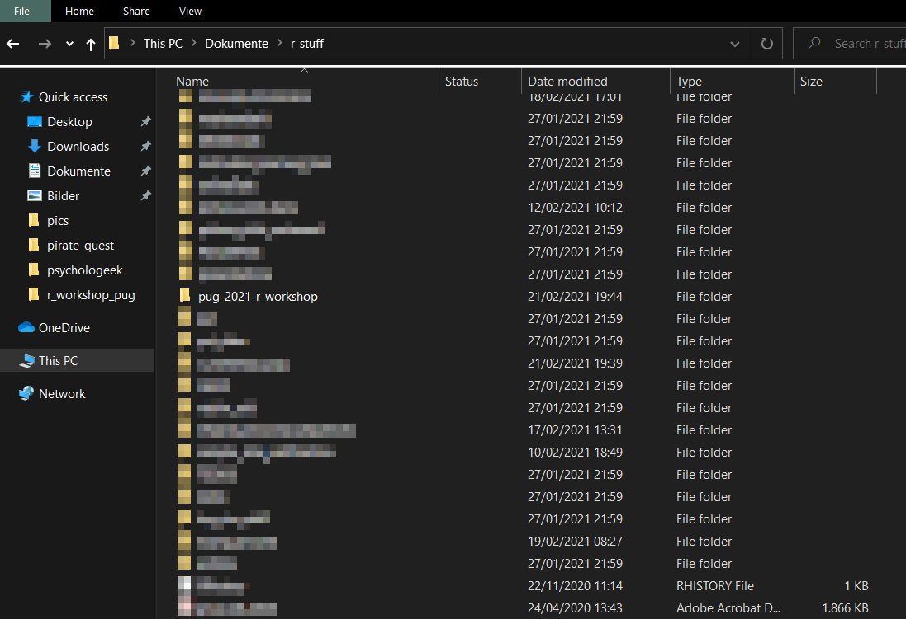
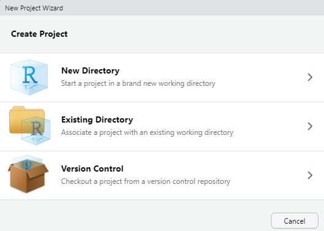
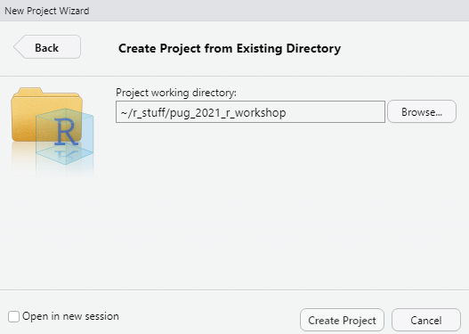
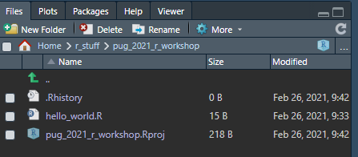

# Creating an R project

## Be structured

We code because we want to save time and effort - we don't want to make things harder for us.
To achieve this, we have to be organised ...
**TO DO: Elaborate**

## Find a place for your R stuff

You want to be able to easily find your code on your computer.
It sounds trivial, but you should have a folder for every project that you do.
And by "project" I don't necessarily mean a full-blown scientific project - it might just be some lines of code that you want to try out.
For example, I have a little project that is called *toying_around*, where I save little bits and pieces of code that I've tried out and that don't really belong anywhere.

For this workshop, for example, you might want to create a folder named *pug_2021_r_workshop*.
Get used to avoiding spaces or any other "funny characters" in your folder names (e.g. German "Umlaute").
We want to open these folders using R, using machine-readable commands.
And machines are really bad at reading things that contain spaces or any other unexpected characters.

Personally, I created my *pug_2021_r_workshop* in a folder named *_stuff*, because I like to keep my `R` stuff in one specific location.
This is the default directory that my RStudio go to when I open it.
Just do whatever suits you.

```{r}

```

## Create your first project

Let us navigate to the folder you just created and put our first `R` script there.
Go to **File** $\to$ **New Project ...** and this is what you should see:

```{r}

```

We already created a folder, so we want to set up a project in an **existing directory**.
Navigate to the folder you just created to set up the project there:

```{r}

```

You will find that RStudio created an `R` project in your workshop folder.
To see how projects work, create a little `R` script first.
If RStudio did not open a script for you already, do so with **File** $\to$ **New File** $\to$ **R Script**.
For now, just type "Hello world" into the script and save it by clicking the little save icon.
(Why ["Hello world"](https://en.wikipedia.org/wiki/%22Hello,_World!%22_program), you ask?)

Check the folder you just created. You will notice that your script was automatically saved in this location.
This is because when using a project, you will always be in the location where your project file lies.
It basically works like the "you are here" icon on a map.
It is quite handy that we don't have to look for the folder we want every time we create and save a new script.

However, your script is now probably named *Untitled1.R*. This is not a good name because you don't really know what it contains.
We should have saved it using **File** $\to$ **Save as ...** (maybe under the name *hello_world.R*), but we can just rename it by clicking **File** $\to$ **Rename**.
Close RStudio for now.

Head back to your project folder and double click on the Rproject file belonging to your project.
You will notice that once again, you are in your project folder that contains the script you created earlier.
There should be a **Files** panel in your RStudio where you can see everything that your project folder contains.

```{r}

```

## Project-oriented workflow

Why a project-oriented workflow is so powerful ... bla bla. We will learn about that later.

Has its merits because ... mention Jenny Bryans slides:
https://twitter.com/hadleywickham/status/940021008764846080/photo/1
