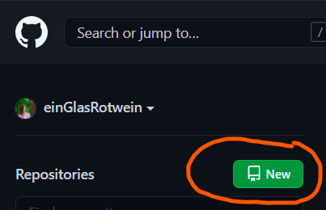
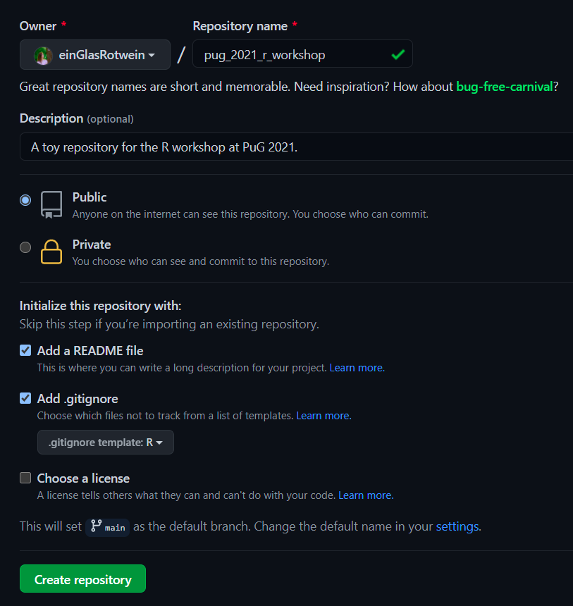
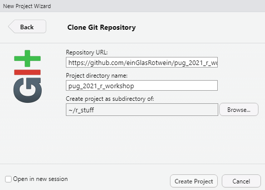
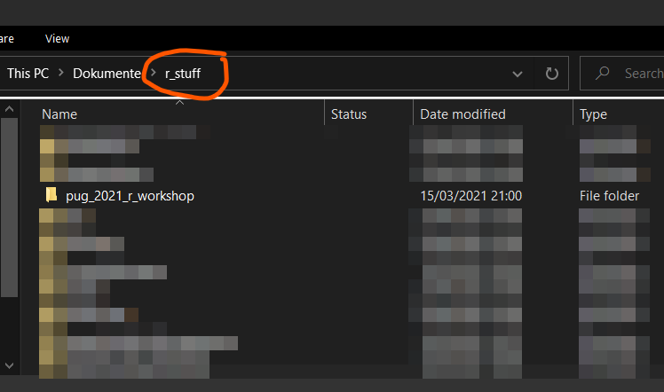
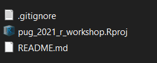

# Creating an R project

## Find a place for your R stuff

You want to be able to easily find your code on your computer.
It sounds trivial, but you should have a folder for every project that you do.
And by "project" I don't necessarily mean a full-blown scientific project - it might just be some lines of code that you want to try out.
For example, I have a little project that is called *toying_around*, where I save little bits and pieces of code that I've tried out and that don't really belong anywhere.

For example, you might want to create a folder named *my_r_projects* on your computer.
Get used to avoiding spaces or any other "funny characters" in your folder names (e.g. German "Umlaute").
We want to open these folders using `R`, using machine-readable commands.
And machines are really bad at reading things that contain spaces or any other unexpected characters.

This folder will be filled with all your `R` projects.
You might prefer a different structure, that is completely up to you.
However, you need to make a decision about where to put your future `R` projects - and what we will do in this workshop will live in one of these projects.

By the way, you can find amazing tips for folder structure, file naming and `R` projects in these slides by [Danielle Navarro](https://slides.djnavarro.net/project-structure/#1).

## Create your first project

After you decided where you want to put your `R` stuff, we should create our first project which will contain everything you do during this workshop.
However, we will not create another folder for this workshop right away.
Remember that we want to use version control (time travel) throughout this workshop, because I want you to get used to it right from the beginning.
That means we will start by creating a new repository on GitHub.[^1]
Everything you do will be backed up there and you will always be able to restore previous versions of your script.
It is also a great way of tracking how much you actually achieved within these two days!
Log in to GitHub and create a new repository with the big green "new" button.

[^1]: There are other ways to use version control, e.g. you *could* start with creating a folder first, but we will not go through all the possibilities in this workshop. I think the procedure I show you is the easiest one, but it is certainly not the only way.

```{r}

```

Choose a name for your repository, e.g. *pug_2021_r_workshop*.
You can also provide a short description for your repository, e.g. something like "This repository contains my coding exercises at the PuG 2021 R workshop."
Your repository can be private, which means only you will be able to see it, or public, which means everyone will be able to see it.
If you make it public, it will be much easier for me and other participants of the workshop to collaborate with you, but of course, the decision is up to you.
You can add a README file - this file will be shown at the front page of your repository, providing information to everyone visiting.
By default, it will contain your repository's title and the description from above (if you made one).
You can also add a **gitignore** - this is a very useful thing to have because it determines what you want to be on GitHub - and what not.
You might e.g. want to tell GitHub that it should ignore the raw data file in your project, because you don't want to upload any sensitive data or simply because the file is too large to be uploaded.
If you tick the gitignore box, you can use a gitignore template that has some default settings for `R` - just select `R` from the dropdown list.
Lastly, you can set a licence that determines if and how other people can use your code.
You can read up about what those licences mean later, but for our workshop, we won't use any.
Great, now hit that create button!

```{r}

```

Now let's get this repository to your computer..
In RStudio, go to **File** $\to$ **New Project ...** and this is what you should see:

```{r}
knitr::include_graphics("./pics/new_project.png")
```

We want to use GitHub, which is, as you know, a form of **version control**.
So this is what we'll pick.
Next, choose **Git**.
RStudio will then ask you for a repository URL and where to save the repository on your computer.
Just put in the link to your repository (copy it from your browser) - `R` will then detect the repository name and use that name for the corresponding folder on your computer.
You can of course change that name, but I strongly advise not to do that, because it will lead to **A LOT** of confusion.
Lastly, `R` asks you in which folder your new repository folder should be saved.
In my case, this folder is called `r_stuff`, because this is where all my `R` stuff is saved.

```{r}

```

You will find that RStudio created a folder with the same name as your repository in at the place where you told it to put it.

```{r}

```

Look inside.
The folder contains a gitignore and a README file - no surprise, we created those when we created the repository.
But there is also an `R` project file.

```{r}

```

Those projects are really useful and we will always use them throughout this workshop.
To see how projects work and why they are so powerful, we create a little `R` script first.
If RStudio did not open a script for you already, do so with **File** $\to$ **New File** $\to$ **R Script**.
For now, just type "Hello world" into the script and save it by clicking the little save icon.
(Why ["Hello world"](https://en.wikipedia.org/wiki/%22Hello,_World!%22_program), you ask?)

Check your folder again. You will notice that your script was automatically saved there.
This is because when using a project, you will always be in the location where your project file lies.
It basically works like the "you are here" icon on a map.
It is quite handy that we don't have to look for the folder we want every time we create and save a new script.

However, your script is now probably named *Untitled1.R*. This is not a good name because you don't really know what it contains.
We should have saved it using **File** $\to$ **Save as ...** (maybe under the name *hello_world.R*), but we can just rename it by clicking **File** $\to$ **Rename**.
Close RStudio for now.

Head back to your project folder and double click on the Rproject file belonging to your project.
You will notice that once again, you are in your project folder that contains the script you created earlier.
There should be a **Files** panel in your RStudio where you can see everything that your project folder contains.

```{r}
knitr::include_graphics("./pics/files.png")
```

## Project-oriented workflow

Why a project-oriented workflow is so powerful ... bla bla. We will learn about that later.

Has its merits because ... mention Jenny Bryans slides:
https://twitter.com/hadleywickham/status/940021008764846080/photo/1

```{r child = "03_basics.Rmd", echo = FALSE}
```
