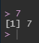

# Basics in R

First, you need to understand some basic principles about `R` - or about programming languages in general.
You already know that we usually don't click buttons - we type commands into `R`.
To see how that works, we'll first take a look at the console.
For starters, type in any number and hit return.
What happens?

```{r}

```

We put in our "command" (in that case, simply the number 7) and `R` "returned" an answer.
In this case, 7, so just the number we typed in.
`R` also numbers the elements that are "printed", this is why there is this `[1]` at the beginning of the line.


