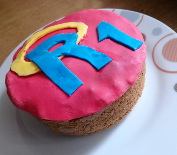
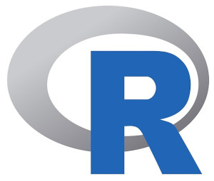
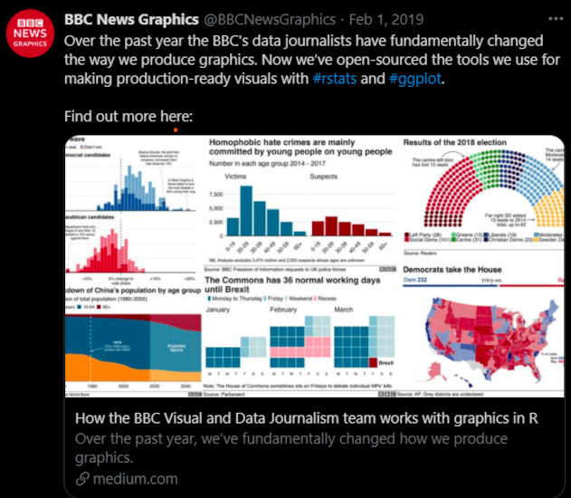
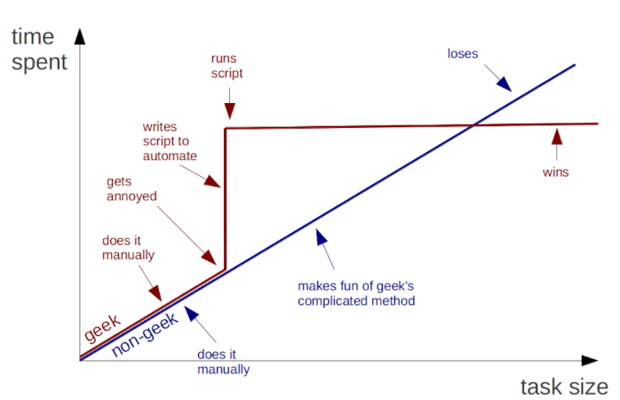
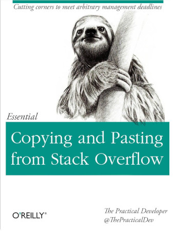

```{r setup, include=FALSE}
knitr::opts_chunk$set(echo = FALSE)
```

## Nice to meet you
<div class="columns-2">
  

- Juli Tkotz
- PhD student at the Central Institute of Mental Health, Mannheim
- RG Psychology and Neurobiology of Sleep and Memory
- I like R
</div>

## Orga stuff
- Workshop timing etc.
- Breaks?
- Anything else?

## I REALLY like R
 

## About R
<center>

</center>

- Popular programming language for data science and statistics.
- Data wrangling, analysis and visualisation.
- But also manuscripts, presentations (like this one), web apps ...

***
<center>

</center>

## R is quirky
- INSERT HEX STICKER PIC HERE
- R is developing rapidly.
- It's open source and there are tons of additional packages you can use.
- You have to manage your "dependencies".
- This can be a bit overwhelming.
- Don't avoid updating your R and all the packages.
- Embrace the quirkiness :-)

## What can you expect?
<div class="columns-2">
  

- Sorry, you can't learn to code in 2 days.
- **But** you will acquire the basic skills for the journey ahead.
- Learning is only possible by doing. **No excuses: Start. Using. Code. Now!**
</div>

## Coding is good for you


- Eventually saves time and reduces copy-paste mistakes.
- Key to reproducible science.

## Googling is okay
<div class="columns-2">
  

- You don't need to know how to do it - but you need to know where to look.
- We will use Google and the R documentation along the way.
</div>

## Let's dive in!
- They already forked their GitHub repo?
- Open script whatever ...

