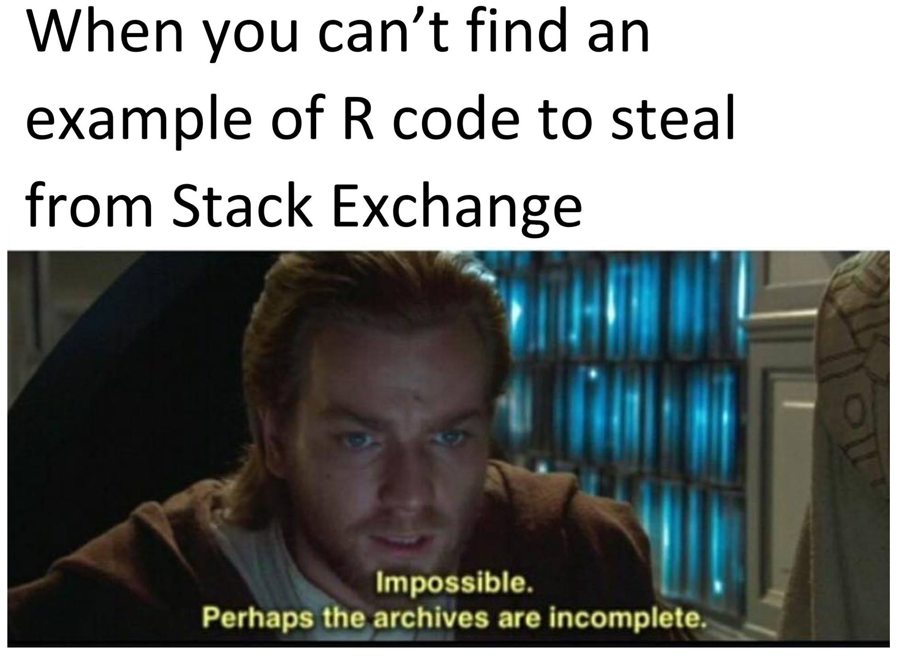

```{r setup, include=FALSE}
# You can see this chunk has a name (setup). It might make sense to name chunks for structure,
# but it is absolutely not necessary and I'm too lazy to name all the chunks in this document.
knitr::opts_chunk$set(echo = TRUE)

# Put libraries you want to use here.
library(tidyverse)
library(effectsize)
library(kableExtra)
library(papaja)

# We run our analysis in a separate file so it won't clutter our rmarkdown document
source("example_analysis.R")
```

## A simple document

This is a simple html document, which is the document type that is the easiest to handle ($\LaTeX$ and Word is more difficult).
However, I will also include example files for other document types.

## Formatting

It makes sense to start a new line for each sentence.
This way, it is easier to see changes in version control (e.g. GitHub).
In version control, changes are usually shown per line, and if a single line consists of 60 sentences, that becomes messy.
You will notice that a line break is not the same as a return in a Word document.

To start a new paragraph, you need to leave a blank line.

### More formatting

The more \# you add before a headline, the "lower", the headline is.
\# indicated the title, \#\# is a second level headline etc.
You get **bold text** (`**bold text**`) with two asterisks, and *italics* (`*italics*`)  with one asterisk.
You can get code in backticks: `This is code.` (\`This is code.\`)
Backslashes can be used to escape characters that shouldn't be a command, e.g. when you want to print an asterisk \* instead of having italics.

You can include images like this (paths are always relative to the R Markdown file location):

```{r out.width='70%', fig.align='center'}

```


## R code

You can use `R` code in code chunks like this:

```{r cars}
summary(cars)
```

Using the package `kableExtra`, you can get nice html tables:

```{r}
summary(iris) %>% 
  kable() %>% 
  kable_styling("striped")
```

You can also include plots.
Here, the code is not shown because I used the chunk option `echo = FALSE`.

```{r pressure, echo=FALSE}
iris_plot
```

You can also use `R` in the middle of the text.
I can e.g. report the mean in my text like this: `r knitr::inline_expr('mean(c(1, 2, 3)')`, which will then print: `r mean(c(1, 2, 3))`.
Don't forget the little `r` to indicate the language.
We could report the t-test we just calculated like this: $t$(`r round(t_test_iris$parameter, 2)`) = `r round(t_test_iris$statistic, 2)`, $p =$ `r round(t_test_iris$p.value, 3)`.

## Citations

At the top of the document, I defined a bibliography containing information about papers I want to cite in the BibTex format.
You can download BibTex files for most papers on the website of the paper or generate one with your reference manager.

I can cite authors in the middle of the sentence like this: For example, @feld_2017 write that ...
Or I can cite the paper in brackets at the end of a sentence [@feld_2017].
A reference list will automatically be generated.
Note that you should add a references heading at the end of your document, otherwise, the reference list will be rendered directly after your text.

## References
